# Donkey Car Manager 🚗

`Donkey Car Manager`는 동키카(Donkey Car)의 데이터를 관리하고 제어하기 위해 개발된 C# 프로그램입니다.

## 📌 주요 기능

* **동키카 연결 및 제어**: 네트워크(TCP/IP, Serial 등)를 통해 동키카와 통신 및 상태 모니터링
* **데이터 관리**: 동키카 주행 중 수집된 로그 데이터, 이미지, 학습 모델 파일 관리
* **실시간 대시보드**: 차량의 현재 속도, 조향각(Steering), 배터리 잔량 등을 시각적으로 표시
* **사용자 친화적 UI**: 복잡한 설정 없이 직관적으로 조작할 수 있는 인터페이스 제공

---

## 🛠️ 개발 환경 및 기술 스택

* **Language**: C#, Python
* **Framework**: .NET 8.0
* **UI Framework**: WinForms
* **IDE**: Visual Studio 2026 이상 
 
---

## 🚀 시작하기
### 실행화면

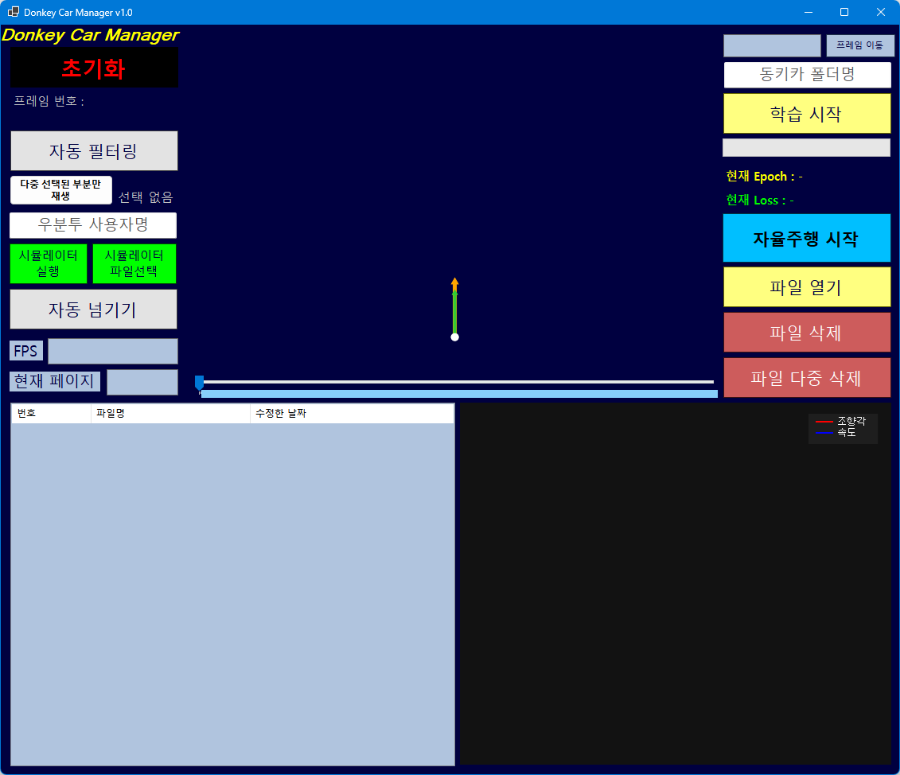
* 초기화면
* 화면 구성
  * 시뮬레이터 실행 버튼
  * 파일 불러오기 버튼
  * 정렬 버튼
  * 프레임 선택 텍스트박스
  * 페이지 선택 텍스트박스
  * 자동넘기기 버튼
  * 파일 삭제 버튼
  * 파일 다중 삭제 버튼
  * 학습 시작 버튼
  * 조향값 인터페이스

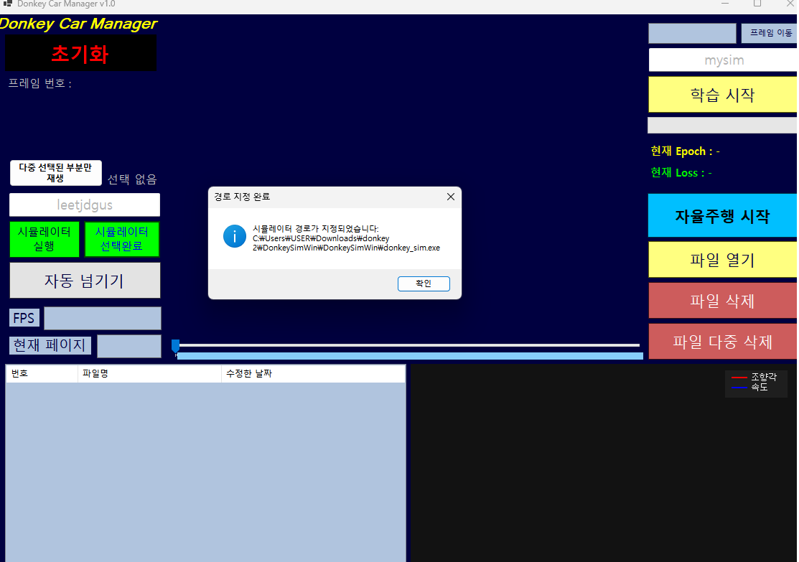
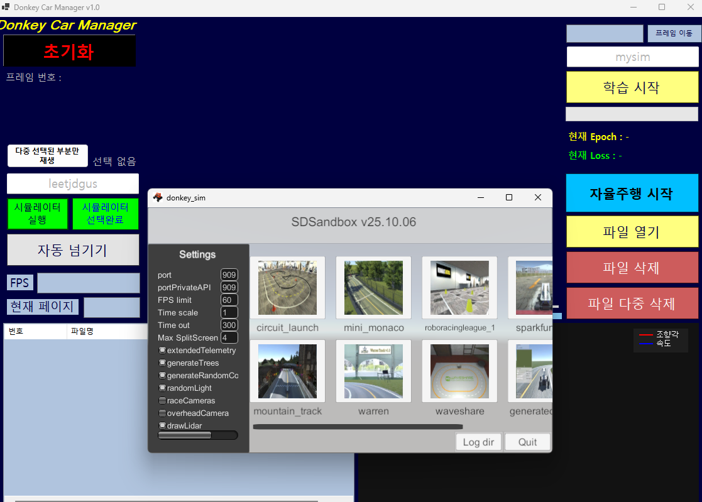
* 시뮬레이터 선택 버튼으로 시뮬레이터를 선택할 수 있습니다.
* 우분투 ID를 입력하여 시뮬레이터를 실행할 수 있습니다.

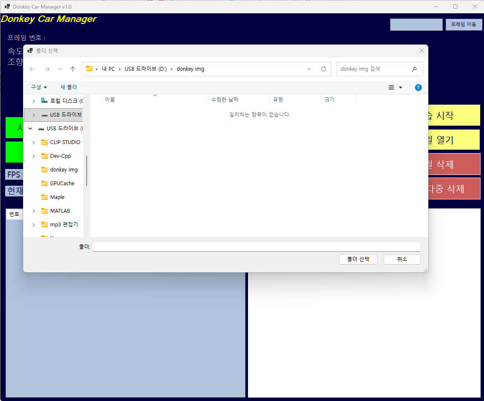
* 시뮬레이터를 통해 수집한 데이터가 있는 폴더를 선택합니다.

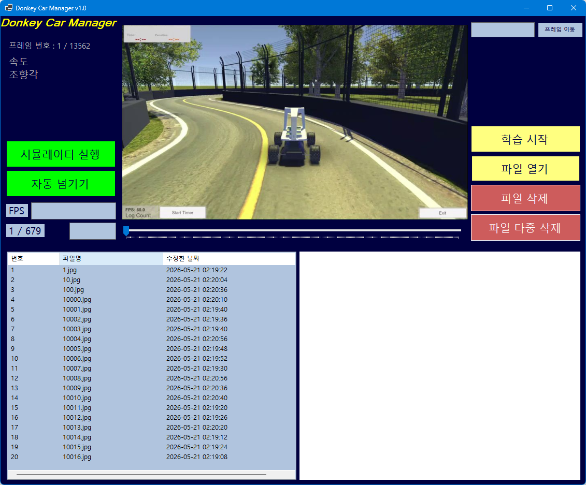
* 파일 불러오기 완료 화면.

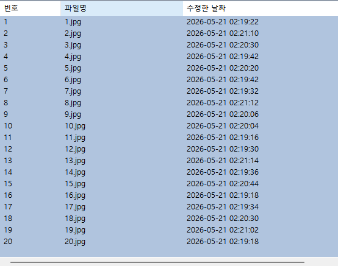
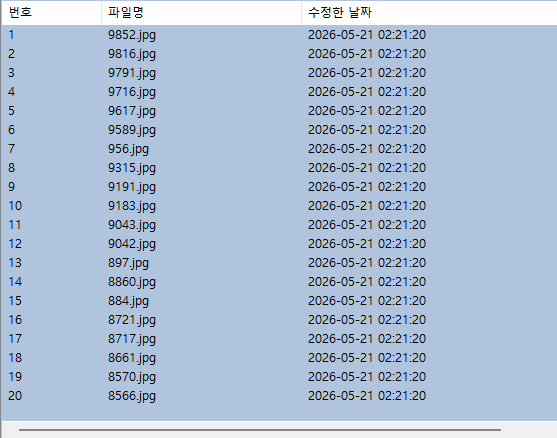
* 이름과 날짜 순서로 정렬할 수 있습니다.

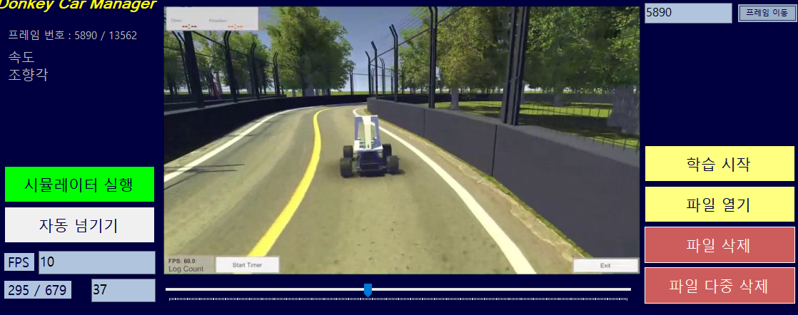
* 프레임의 번호를 입력하여 해당 프레임으로 이동할 수 있습니다.

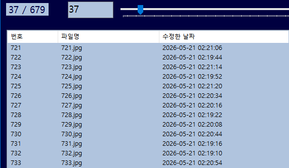
* 페이지 번호를 텍스트박스에 입력하여 원하는 페이지로 바로 이동할 수 있습니다.

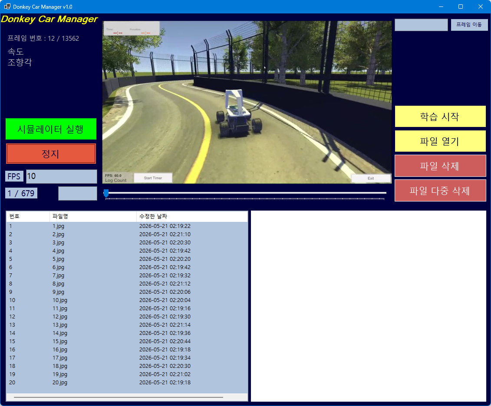
* 자동넘기기 버튼으로 유저가 선택한 FPS로 프레임을 살펴볼 수 있습니다.

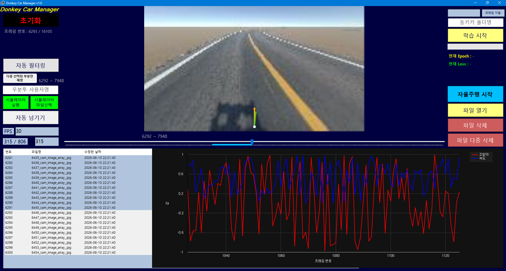
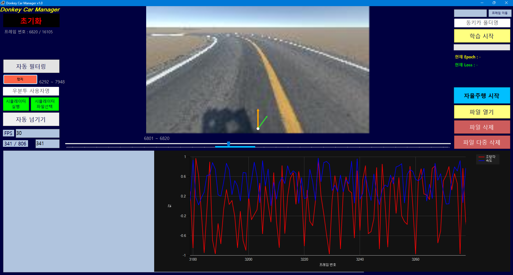
* shift키를 누르고 트랙바를 클릭하면 해당 범위만큼 트랙바를 선택할 수 있습니다.
* 자동넘기기를 누르면 선택한 범위만큼 프레임이 재생됩니다.
* 파일다중삭제 버튼으로 해당 범위만큼 프레임을 삭제할 수 있습니다.

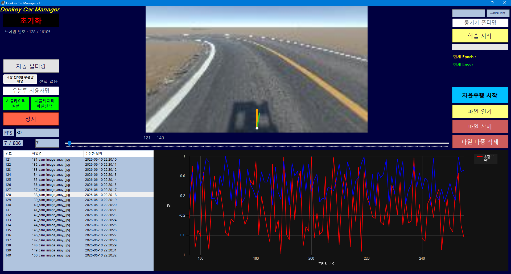
* 프레임의 속도와 조향값을 그래프로 시각화하여 디버깅할 수 있습니다.

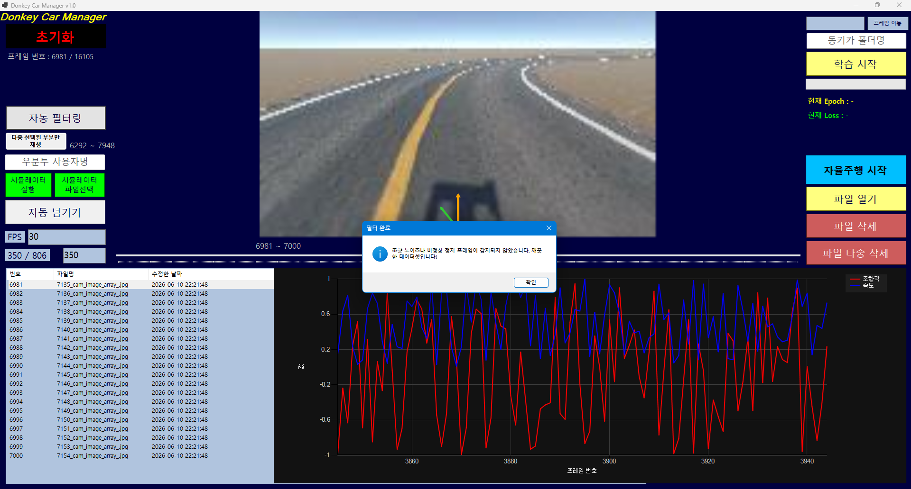
* 조향값이 과하게 어긋난 경우 자동필터링 버튼으로 해당 프레임을 삭제할 수 있습니다.

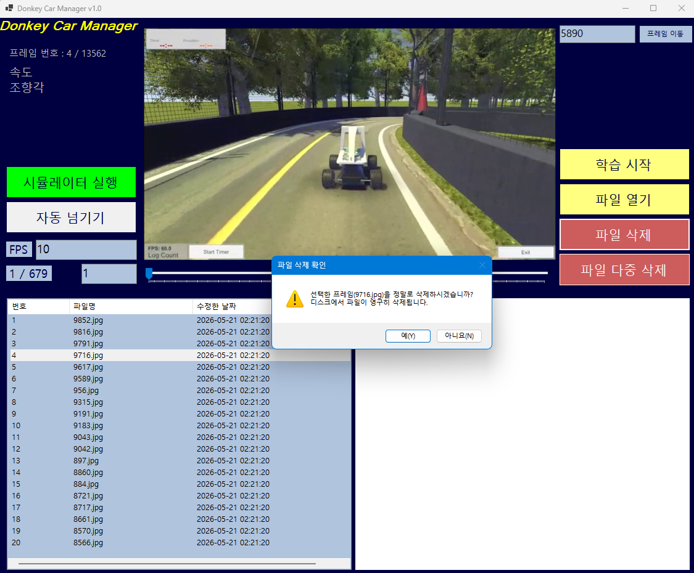
* 파일삭제 버튼 혹은 Delete 버튼으로 단일 프레임을 삭제할 수 있습니다.

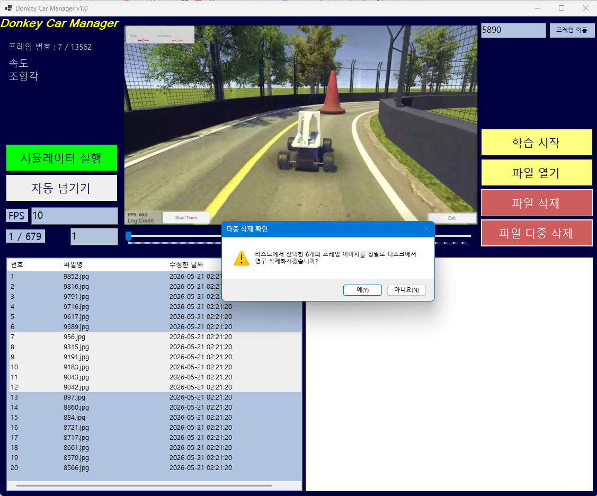
* 파일다중삭제 버튼으로 유저가 선택한 여러 개의 프레임을 동시에 삭제할 수 있습니다.

.png)
.png)
* 학습시작 버튼으로 선택한 데이터로 모델 학습을 시작할 수 있습니다.
* 학습시작 버튼을 누르면 학습의 진행도가 기존 현재 프레임이 나오던 픽쳐박스에 나오게 됩니다.
* 학습에 대한 전체 진행도는 학습 시작 버튼 아래 게이지로 표시됩니다.

.png)
.png)
* 학습된 모델로 자율주행을 구동할 수 있습니다.

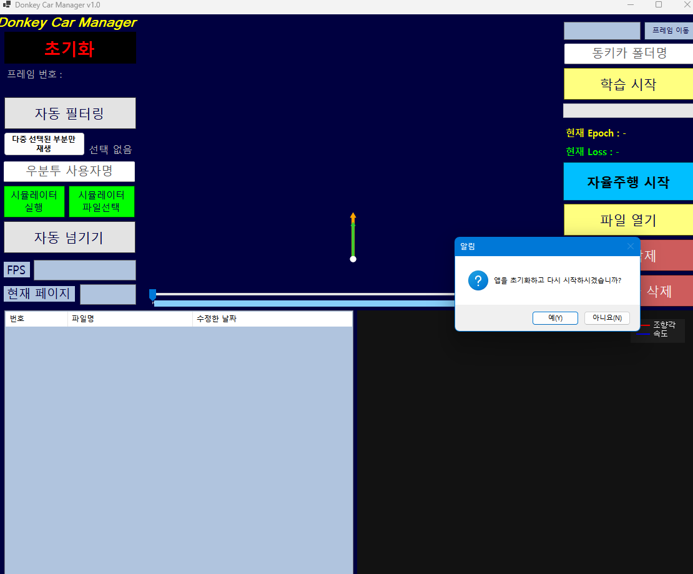
* 초기화 버튼으로 프로그램을 초기화할 수 있습니다.